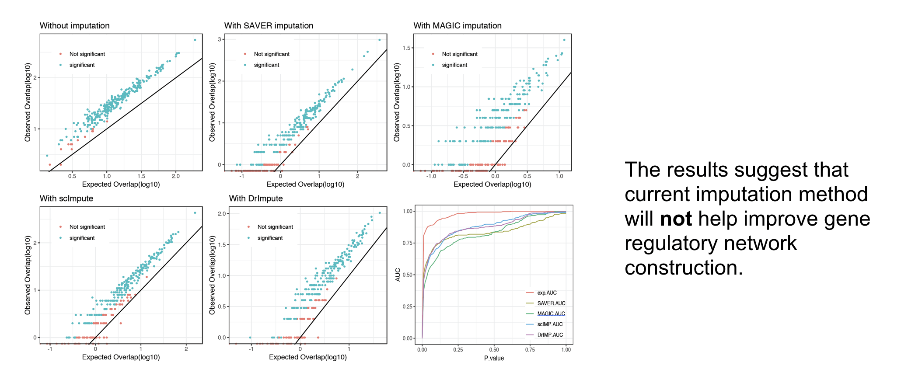
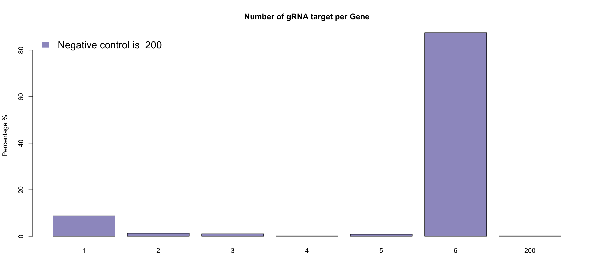
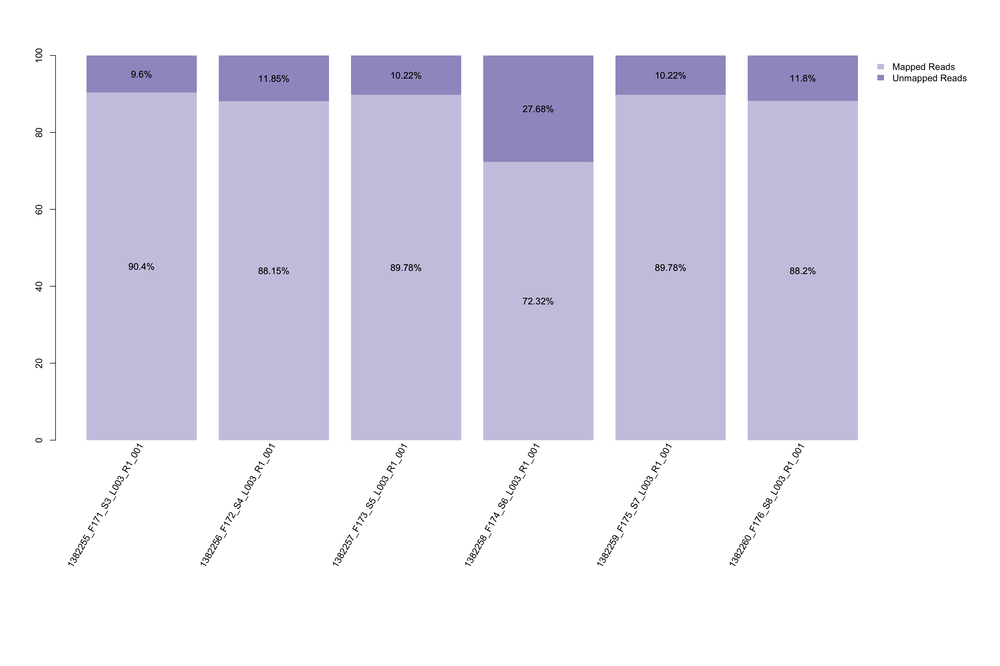
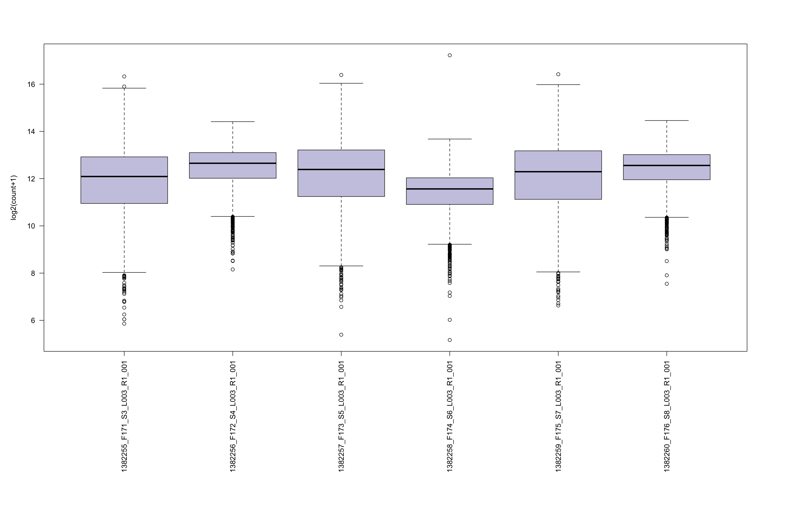
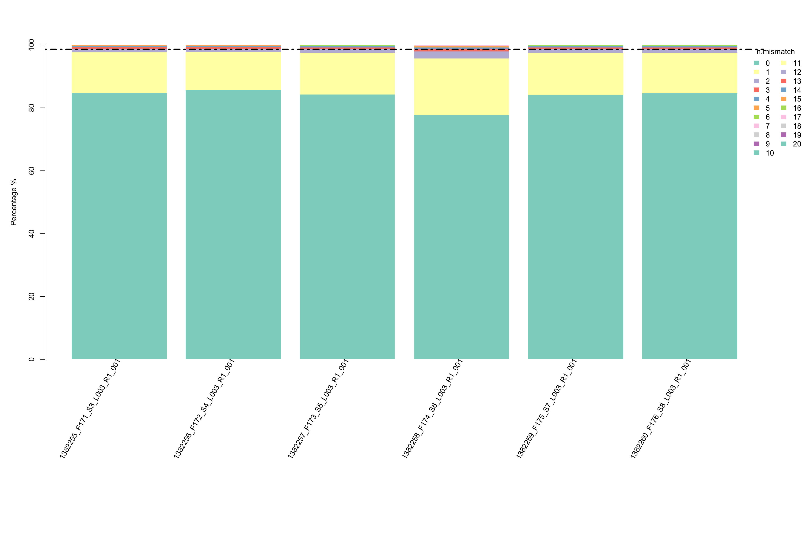
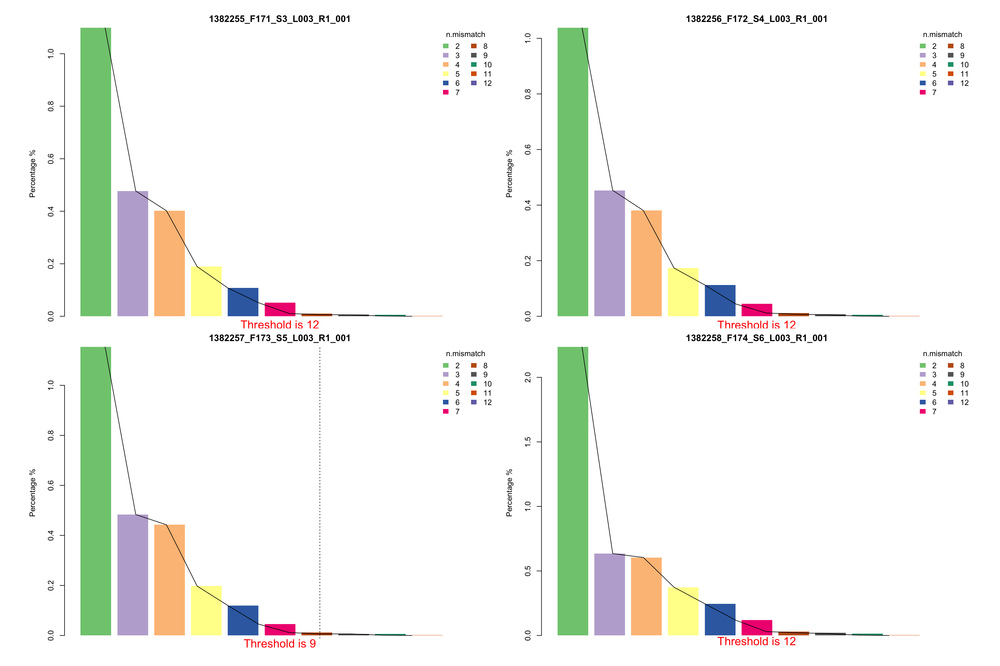

# Tutorial - Mapping via ScreenBEAM2
{:.no_toc}
ScreenBEAM2 is a R based tool which consists of three major parts for processing steps: 1. mapping long read sequence to short read libraries, 2. Quality control, data cleanning and data preprocessing for mapped raw counts data; 3. Differential representative analysis on gene level or shRNA level. 

**This is the first part of the whole tutorial, which is focused on mapping your long read fastq file with short read libraries.**


## Table of contents
{: .no_toc .text-delta }

1. TOC
{:toc}

## Step1.Mapping to library 
### Step1.1 Prepare raw fastq and library files
First of all, define your project name and create a project R object. This could be achieved by function `ScreenBEAM.dir.create`. 

**note: Project object should be library based! One library per run of ScreenBEAM2!**
If you have multiple libraries mapped at the same time, you have to open different R project for different library runs. Our only allows one library at a time. 
```R
lib.name<-'[your_library_name_+_project_name]'
analysis.par<-ScreenBEAM.dir.create(project_main_dir = './', lib_name = lib.name, DATE = T)

analysis.par$par.path<-analysis.par$out.dir 
analysis.par$par.name<-paste0("analysis_par_",lib.name, ".RData")

save.image(file = paste0(analysis.par$par.path, analysis.par$par.name)) #save your image
```

Next, soft link your fastq file to `analysis.par$out.dir.fastq` folder. This step is **ESSENTIAL**, please **DON'T** move files directly, in case of losing your data. Before you soft link data files, we suggested double check your fastq files with your meta data, to make sure all fastq files were mapped to your designated library.

You can go to your `analysis.par$out.dir.fastq` folder, then run command:

```Shell
ln -s file1
ln -s file2
...
```
or if you would like to link all fastq files in one folder, you can simply run:

```Shell
ln -s [your folder path]/*_R1_001.fastq .

```

Then put your library csv file in the `analysis.par$out.dir.library` folder. The 1st column must be gRNA name and 2nd column must be sequence. An example library file would be like:

id | seq | gene|
| ------------- |:-------------:| -----:|
TargetMouse.sg1| AAAAAGAAATGCTCTACCAG | Ypf1
TargetMouse.sg2| AAAACACATACGTCTGTGAG | Cwc12
TargetMouse.sg3| AAAACCGAGCACCATCAATG | Lck2

Then go to `analysis.par$out.dir.library` folder and run following command to create fasta file for library.

```Shell
awk FNR-1 your_library.csv | awk -F "," '{print ">"$1"\n"$2}' > your_library.fa" 
```

Then you could move forward to mapping and collecting raw counts step, which could be executed either on a high performance computing platform or your local machine.


### Step1.2 Mapping and collecting raw counts

First of all, please ensure `blat` was installed in your working environment, since we will be utilizing `blat` for library sequence mapping. (You can use blat version [here on conda](https://anaconda.org/bioconda/blat))

**NOTE: Please make sure your R is able to recognize blat. Please check whether blat has been added to your local bin**

Next, we wil need to execute `ScreenBEAM.raw.count` function in ScreenBEAM2 R package. This function will help mapping your fastq files to library and collect raw counts by calling BLAT from R. This function will execute 1)get basic statististics, 2) create fasta from fastq and run blat, and 3) collect raw counts sequentially, so it may take a while for large sequencing data or whole genome libraries. Please try using more powerful computing platform if this is your case.

```R
analysis.par<-ScreenBEAM.raw.count(analysis.par)
# save your analysis results
save(analysis.par, file = paste0(par.path, par.name))

```
**NOTE: Also, some fastq files are ultra big, you may need to chop them into small fastq files in order to execute them successfully.**


### Step1.3 Mapping qualtiy control

After mapping is done, please proceed your analysis back in interactive environment (such as R studio). We are going to perform quality control, data annotation and data cleaning 

For mapping quality control, we designed a customized QC rmarkdown file, if you have ScreenBEAM2 installed, you can run function 'ScreenBEAM.mapping.QC' as follows:

```R
ScreenBEAM.mapping.QC(analysis.par)
```

If you would like to make adjustment on this rmarkdown file, you can edit it and run your final rmarkdown file as follows:

```R
ScreenBEAM.mapping.QC(analysis.par, QC.Rmd.path = [new_path_to_your_rmd]) 
```

This will output a QC report for your library mapping, here is  [example qc report](./mapping_6sample_QC.html), including several useful metrics for mapping rate, mismatch rate, count boxplots, etc.


### Step1.4 Read your mapping quality control

Mapping quality control includes 6 differernt metrics to help you understand your library and mapping quality.

**Library quality**

* Library removed RNA due to duplicated or substring of other RNAs
This table shows all duplicated gRNAs(either perfect match or substring of other gRNA from the same gene). This will help you understand why some genes has less gRNAs than others.



* Total count of the gRNA number for each gene. This will help understand your library. Usually, a library contains hundreds or thousands of negative control gRNA (dummy gRNA) instead of 6(normally 6 gRNA for one gene). ScreenBEAM will take care of this unbalanced negative controls, and random sampling negative control guides to match other genes.



**Mapping quality**
* Mapping rate barplot. This barplot could help visualize how many reads in your samples' fastq files are successfully mapped to library sequence. This could not only help you visualize the data quality of your fastq files, but also give a hint of whether to allow mismatch in your raw data collection.



* Boxplot of raw count distribution in each sample. This plot could help your understand if all samples have similar raw count distribution. It could also give you a hint of how to choose your total number to perform normalization.



* Proportion of number of mismatch within the mapped reads in each sample. This plot could help you understand if all samples have similar mapping quality. 



* Suggestion of number of mismatch to choose for your downstream analysis. This plot visualizes the percentages of different number of mismatch in each samples respectively. If there are two suggested number of mismatch, please use the smaller one.


